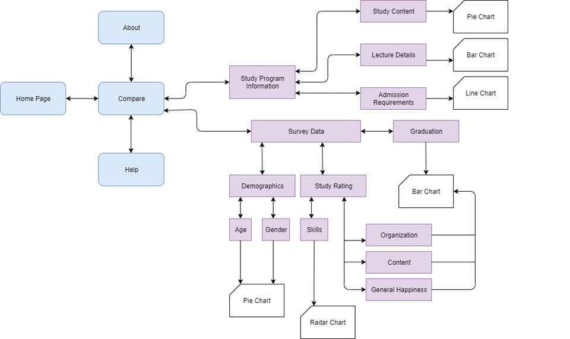
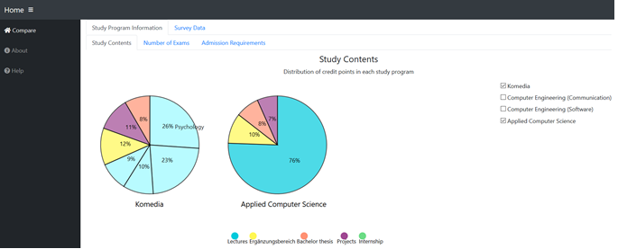
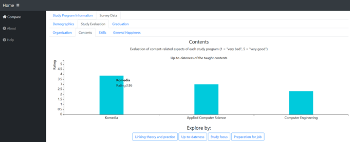
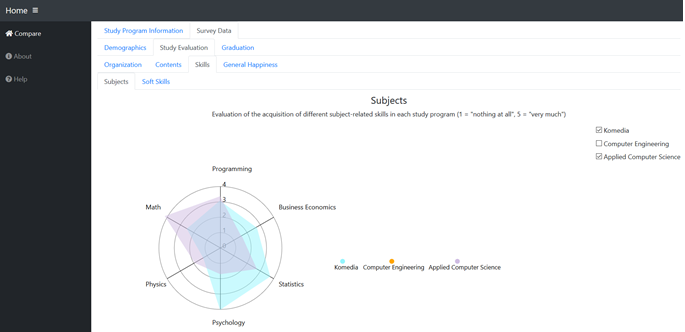
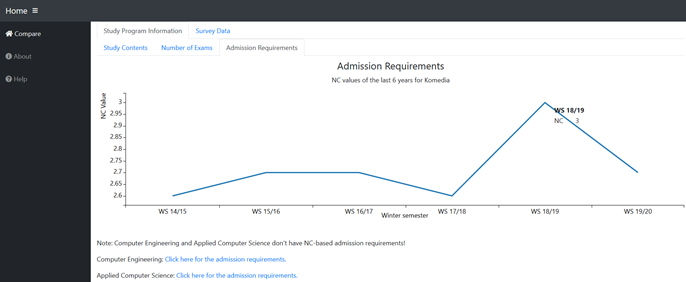

This is an interactive visualization application for people who want to study soon.

The application visualizes different aspects of the three study programs Komedia, Applied Computer Science (AI) and Computer Engineering (ISE) of university of duisburg-essen.

Users can compare study program information (eg. study contents) as well as opinions and evaluations by students of the respective study programs.

After interacting with the application the user should have a clearer understanding of the study contents and also a personal opinion which helps him choose a study program.

This application has two main sections: Study Program Information and Survey Data.

In "Study Program Information" users can get insight into the study contents as well as the admission requirements of the each study program.

In "Survey Data" the results of an online survey by InsightOut are displayed. In the section "Demographics" users can view the demographics of our sample (age and gender). In the section "Study Evaluation" users can see the evaluation of different organizational and content-related aspects of the study programs, the rating of the acquisition of skills, as well as the general happiness. In the section "Graduation" users can see the average final grade of graduated students, the perceived dificulty to graduate in the standard period of study (6 semester), as well as the average number of semester for graduation in each study program.

Project Architecture:



Deployed Version: https://studysoon.herokuapp.com/

Youtube Video: https://youtu.be/wU1TWjeui88

Used Libraries:
1. https://jquery.com/
2. https://c3js.org/
3. https://d3js.org/
4. https://getbootstrap.com/
5. https://nodejs.org/en/
6. https://gulpjs.com/

How to deploy the project locally:
1. clone the repository
2. install node.js from https://nodejs.org/en/
2. run ```npm install``` in the terminal from the project directory
4. run ```npm start``` in the terminal from the project directory
5. got to http://localhost:8080/

Project Screenshots:






Authors:

•	Kaser Mahmoud: a master student of Computer Engineering (Intelligent Networked Systems) at the University of Duisburg-Essen. E-mail: kaser.mahmoud@stud.uni-due.de.

•	Laura Vorgerd: a master student of Applied Cognitive and Media Science at the University of Duisburg-Essen. E-mail: laura.vorgerd@stud.uni-due.de..

